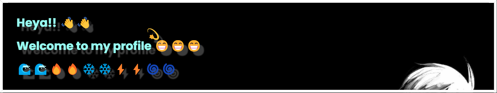

# Hi there 👋

<!--
**kaelune/kaelune** is a ✨ _special_ ✨ repository because its `README.md` (this file) appears on your GitHub profile.

Here are some ideas to get you started:

- 🔭 I’m currently working on ...
- 🌱 I’m currently learning ...
- 👯 I’m looking to collaborate on ...
- 🤔 I’m looking for help with ...
- 💬 Ask me about ...
- 📫 How to reach me: ...
- 😄 Pronouns: ...
- ⚡ Most Likely: ...
-->
 
  
  
  
 

- 📫 How to reach me: Instagram
- ⚡ Most Likely: Valorant, PHP

## -- Social Media 📫 --
<!-- 

 -->

## -- Stats 📊 --

 

## -- Others 🍃 --

